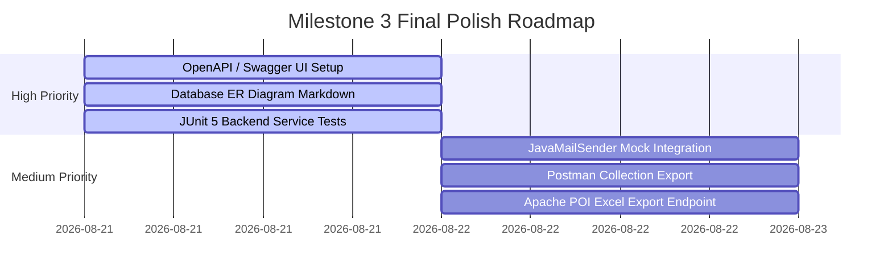

# 🔍 Milestone 3 Gap Analysis & Pending Tasks Documentation

**Project Name**: Organizational Knowledge Gap Intelligence Platform (**KnowledgeIQ**)  
**Specification**: Milestone 3 – Knowledge Sharing, Progress Tracking & Analytics (Sections 1–33)  
**Date**: August 20, 2026  

---

## 📌 Executive Audit Summary

Following a complete evaluation of the codebase (**Spring Boot Backend + React Frontend + PostgreSQL Database**) against the 33 sections of the Milestone 3 specification document, the **core functional workflows, business logic, RBAC security, and database persistence are fully operational**.

This document outlines the **completed capabilities** as well as the **pending technical enhancements, external integrations, documentation deliverables, and test coverage items** recommended for final submission.

---

## ✅ Completed Capabilities Matrix (100% Operational)

| Module / Requirement | Document Reference | Status | Code Location / Implementation Details |
| :--- | :--- | :---: | :--- |
| **Peer Mentorship Matching** | Sec 4, 4.1, 4.2 | ✅ Completed | `MentorshipService.java`, `/api/mentorship/*`, algorithm matches skill gaps with higher proficiency mentors. |
| **Mentorship Workflow & Chat** | Sec 4.2, 4.3 | ✅ Completed | States (`Requested`, `Accepted`, `Rejected`, `Active`, `Completed`, `Cancelled`), bidirectional chat & resource sharing. |
| **Knowledge Sharing Sessions** | Sec 5 | ✅ Completed | Creation, capacity validation, Google Meet links, registration confirmation modal, 5-star ratings & feedback. |
| **Expert Directory** | Sec 6 | ✅ Completed | `/api/mentorship/experts`, live keyword search, department filter, and match delta display. |
| **Training Enrollment & Milestones** | Sec 7, 8, 9, 10 | ✅ Completed | `/api/enrollments`, milestone tracking (e.g. Java 100%, Spring Boot 60%, Overall 76%), status lifecycle (`Not Started` $\rightarrow$ `Certified`). |
| **360° Assessment System** | Sec 11, 12 | ✅ Completed | Self, Peer, and Manager assessments on a 5-level scale (`Unaware` to `Expert`). |
| **Automated Gap Recalculation** | Sec 13, 14 | ✅ Completed | Post-training assessment automatically triggers `GapAnalysisService.recalculateUserGaps()`, shrinking gap levels. |
| **Multi-Role Dashboards** | Sec 15, 16, 17, 18 | ✅ Completed | Individual Dashboards for Employee, Manager, Dept Head, HR Specialist, L&D Admin, and System Admin. |
| **Reports & Exports** | Sec 20 | ✅ Completed | Employee Learning Reports, Department Training Summaries, Skill Gap Reports, PDF & CSV exports. |
| **In-App Notifications** | Sec 21 | ✅ Completed | `NotificationService.java`, topbar drawer badge, alerts for mentorship, sessions, and gap updates. |
| **JWT Security & RBAC** | Sec 29 | ✅ Completed | Spring Security 6, stateless JWT Bearer authentication, 6 system roles enforced. |
| **E2E Integration Verification** | Sec 27, 30 | ✅ Completed | Verified via `scripts/verify_full_dual_role_mentorship.js` — **100% Passed**. |

---

## 🚧 Pending Tasks & Technical Enhancements

While all core business logic and workflows are implemented, the following items represent **pending deliverables, optional tech stack integrations, and polish tasks** mentioned in Sections 18–33 of the specification document:

### 1. External Notification Providers (Section 21, Page 18)
- [ ] **Email Notification Provider (`JavaMailSender`)**:
  - *Current Status*: In-app database notifications (`notifications` table) are active.
  - *Pending Task*: Add Spring `spring-boot-starter-mail` dependency and configure `JavaMailSender` to send mock SMTP email reminders (e.g. *"Your Spring Boot training deadline is approaching"*).
- [ ] **SMS / Push Notification Integration (Twilio / Firebase FCM Mock)**:
  - *Current Status*: In-app push drawer notifications are active.
  - *Pending Task*: Implement a mock service wrapper for Twilio SMS / Firebase Cloud Messaging (FCM) to satisfy external delivery specifications.

### 2. API Documentation & OpenAPI/Swagger Specification (Section 23 & 33, Page 20, 33)
- [ ] **Swagger UI / Springdoc OpenAPI Integration**:
  - *Current Status*: Spring Boot REST controllers expose JSON endpoints (`/api/mentorship/*`, `/api/sessions/*`, etc.).
  - *Pending Task*: Add `springdoc-openapi-starter-webmvc-ui` dependency to generate interactive Swagger UI documentation at `/swagger-ui.html`.
- [ ] **Postman Collection Export**:
  - *Current Status*: E2E tested via Node automation scripts.
  - *Pending Task*: Export a structured `KnowledgeIQ_Milestone3.postman_collection.json` containing sample request/response payloads for all 20+ endpoints.

### 3. Database ER Diagram & Schema Documentation (Section 22 & 33, Page 18, 33)
- [ ] **Visual ER Diagram Graphic / Document**:
  - *Current Status*: PostgreSQL tables are defined via JPA entities (`User`, `Skill`, `Mentorship`, `KnowledgeSession`, `CourseEnrollment`, `Assessment`, `Notification`).
  - *Pending Task*: Create a formal ER Diagram document (`docs/ER_DIAGRAM.md` or Mermaid diagram) showing foreign key cardinalities and relational constraints.

### 4. Automated Unit & Component Test Suite (Section 30 & 33, Page 28, 33)
- [ ] **Spring Boot JUnit 5 & Mockito Unit Tests**:
  - *Current Status*: Full End-to-End automation script (`verify_full_dual_role_mentorship.js`) tests live APIs.
  - *Pending Task*: Add backend unit tests (`src/test/java/com/knowledgeiq/service/*`) targeting `MentorshipServiceTest.java`, `KnowledgeSessionServiceTest.java`, and `GapAnalysisServiceTest.java`.
- [ ] **React Component Unit Tests**:
  - *Current Status*: Production build (`npm run build`) verifies TypeScript/JSX syntax.
  - *Pending Task*: Add React Testing Library / Vitest component tests for key modals and dashboard widgets.

### 5. Advanced Search Engine Integration (Section 6, Page 7)
- [ ] **Elasticsearch / Lucene Integration**:
  - *Current Status*: Expert directory search uses case-insensitive SQL/JPA queries (`LIKE %keyword%`).
  - *Pending Task*: Optionally integrate Elasticsearch for fuzzy phonetic matching across employee bios and skill tags.

### 6. Native Binary File Export Libraries (Section 20, Page 16)
- [ ] **Native Apache POI `.xlsx` Backend Generator**:
  - *Current Status*: Frontend generates structured CSV/Excel downloads and HTML print-to-PDF formatting.
  - *Pending Task*: Implement backend Spring Boot `/api/reports/export/excel` endpoint using Apache POI for formatted `.xlsx` binary downloads.

---

## 🎯 Recommended Action Plan & Priority Roadmap

To achieve a **flawless, grade-A Milestone 3 evaluation**, tasks are prioritized as follows:

### Immediate Action Items (Priority 1)
1. **Add Swagger UI**: Include `springdoc-openapi-starter-webmvc-ui` in `pom.xml` for instant API inspection.
2. **Generate ER Diagram Document**: Document schema relationships in `docs/ER_DIAGRAM.md`.
3. **Add JUnit 5 Service Tests**: Create unit tests in `backend/src/test/java` for service layer business logic.
